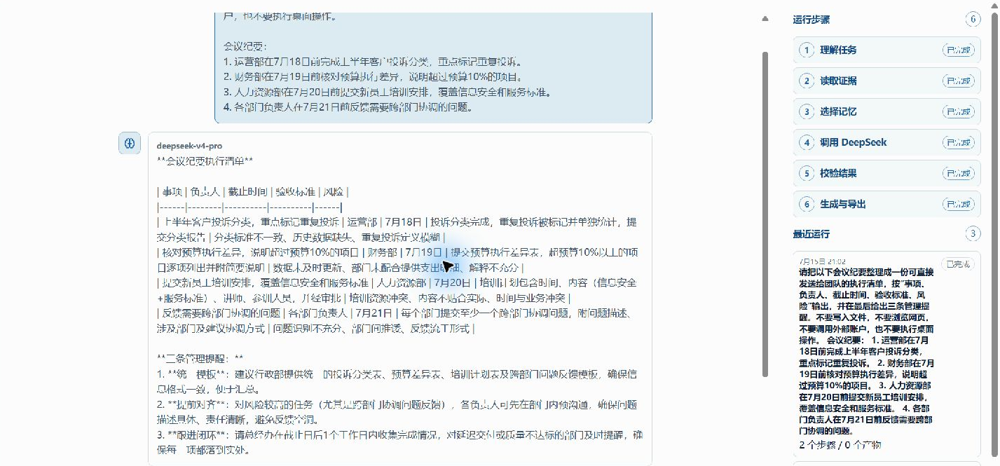
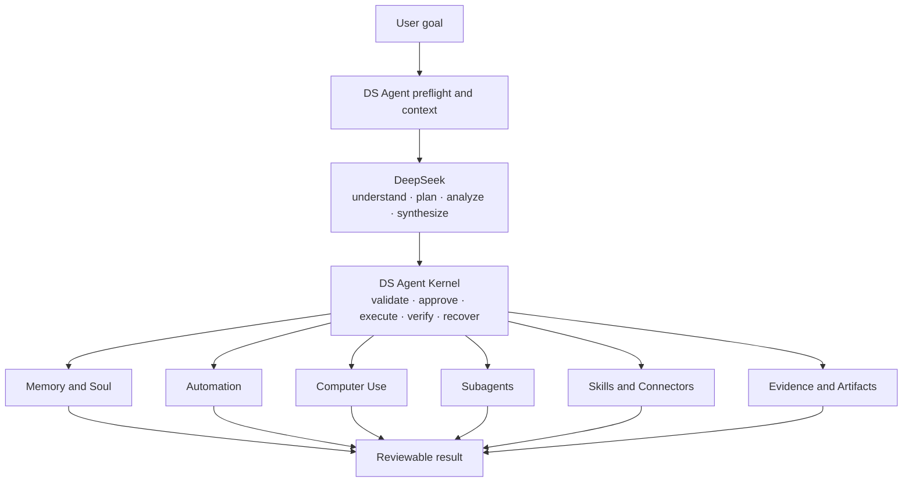

<p align="center">
  
</p>

<h1 align="center">DS Agent</h1>

<p align="center"><strong>One Kernel. Modular capabilities. Verifiable execution.</strong></p>

<p align="center">
  <a href="README.md">English</a> · <a href="README.zh-CN.md">中文</a>
</p>

<p align="center">
  <a href="https://github.com/Lee-take/dsagent/releases/tag/v1.0.2">v1.0.2 stable</a> ·
  <a href="https://github.com/Lee-take/dsagent/releases/download/v1.0.2/DS.Agent_1.0.2_x64-setup.exe">Download for Windows</a> ·
  <a href="LICENSE">Apache-2.0</a>
</p>

<p align="center">Created and maintained by <strong>Lee take</strong>.</p>

DS Agent is a DeepSeek-first local Windows agent for everyday work. Describe the
result you need in chat: it can organize office material, research with sources,
work with local files, run durable automations, and control desktop apps when you
approve—while keeping steps, evidence, permissions, verification, and recovery
visible.

Under the hood, DS Agent is a local Agent Harness optimized for DeepSeek. The
Harness gives model-backed work a durable, permissioned, and verifiable
execution boundary on the local machine.

DS Agent began from a practical need: more colleagues were using DeepSeek in
daily work, yet it was difficult to find an Agent specifically optimized for
DeepSeek with strong local automation and a trustworthy execution boundary.

<p align="center">
  
</p>

<p align="center"><em>A real local v1.0.0 run: meeting notes become a ready-to-send execution checklist, with every run step visible and completed.</em></p>

## What you can do today

- **Turn office input into action.** Convert meeting notes, requirements, or
  rough material into structured checklists, plans, reports, and handoffs.
- **Build evidence-backed briefings.** Read selected local files or public web
  sources, preserve source links, and produce reviewable summaries.
- **Keep recurring work running.** Create one-time, daily, weekly, or monthly
  automations with persisted schedules, bounded retries, and recovery state.
- **Use the desktop with control.** Let DS Agent operate supported local apps
  only through explicit permissions, pre/post observation, and verification.

## One Kernel, modular capabilities

The key difference is that Memory, Automation, Computer Use, parallel
Subagents, and Skills are not isolated plugins. They form one complete loop
coordinated by the same DS Agent Kernel.

DS Agent uses a contract-first modular Harness architecture. New tools,
connectors, workflows, Skills, and executors enter through shared contracts for
permissions, resource locking, idempotency, evidence, audit, verification, and
recovery. A module does not bypass the Kernel, and it does not need to rebuild a
separate state machine or safety system.



## Five core capabilities, one engineering philosophy

### Memory and Soul

DS Agent selects useful long-term memory instead of saving every conversation.
Memory receipts explain what was used and why; feedback influences later
retrieval; auditable background maintenance can update, merge, or archive
memory. Soul keeps a user-approved identity, communication style, and
collaboration preferences consistent across conversations.

### Durable Automation

Natural-language goals can run once, daily, weekly, or monthly. Schedules,
trigger windows, run state, missed-run policy, and results are persisted so work
can recover after restart. Resource locks, bounded retries, and idempotency
checks prevent duplicate execution. A scheduled task never receives broader
authority than an interactive task.

### Verified Computer Use

Desktop control follows a complete safety loop:
`pre-observe → approve → revalidate → act once → post-observe → verify`.
User takeover stops control, uncertain effects are not replayed automatically,
and computer control requires a one-shot approval plus a local in-memory unlock
code.

### Parallel Subagents

Complex work can be divided into bounded Research, Analysis, Production, and
Review roles. Subagents use isolated context, resources, budgets, and staging;
Review binds its decision to the exact production revision; the parent produces
one final synthesis instead of flooding the main conversation.

### Generated and automatic Skills

DS Agent can turn suitable instructions into declarative Skills, validate and
activation-test them, and keep a stable identity when they are updated.
Installed Skills can be selected automatically when a task needs them. Source,
integrity, permissions, trust state, execution plans, audit events, and
disable/uninstall controls remain visible and enforceable.

## Loop Engineering

DS Agent treats work as a goal-directed loop, not a single model reply:

`goal → done-when contract → context → plan → permission → execution → evidence → verification → recovery`

The Kernel persists run and review state, retries only bounded failed steps, and
does not claim completion from model confidence alone. Local files, browser
actions, Office artifacts, and Computer Use are complete only when observable
evidence satisfies the task's completion criteria.

## DeepSeek and DS Agent boundary

| Layer | Responsibility |
| --- | --- |
| **DeepSeek** | Open-ended understanding, planning, analysis, drafting, and synthesis. |
| **DS Agent Kernel** | Deterministic readiness, context packaging, policy, approval, execution, evidence, audit, verification, and recovery. |

DeepSeek proposes actions; DS Agent decides whether they are safe and allowed to
run. The model never receives direct local authority and cannot approve its own
high-risk action. See the full [model boundary](docs/AGENT_MODEL_BOUNDARY.md).

## More built-in capabilities

- Local files, folders, source-linked web research, browser actions, terminal
  diagnostics, screenshots, and permissioned desktop input.
- Markdown, HTML, lightweight PDF, Office-style artifacts, evidence receipts,
  reports, and portable work packages.
- Review, Recovery, durable checkpoints, stale-action rejection, and verified
  one-shot undo for supported local file changes.
- Microsoft/Google-shaped mail, calendar, sync, draft, mutation, and
  reconciliation contracts validated with offline adversarial fake providers.

Production Microsoft/Google account registration and live external-write
authority remain disabled in v1.0.2. The release does not sign in to real
accounts, send real email, or create, change, or cancel real calendar events.

## Why Rust

The DS Agent Kernel and desktop command layer use Rust to keep local execution
predictable, strongly typed, memory-safe, and low-overhead. Rust is especially
valuable for concurrency, resource ownership, durable state transitions,
credential isolation, and exact error handling. Tauri commands and the React UI
remain thin; the Kernel and persistent projections own business state.

## Quick start

1. Download the [Windows x64 installer](https://github.com/Lee-take/dsagent/releases/download/v1.0.2/DS.Agent_1.0.2_x64-setup.exe).
2. Make your own valid `DEEPSEEK_API_KEY` available to the DS Agent process.
3. Choose one local workspace on first run.
4. Describe the result you want in chat. DS Agent requests additional
   permissions or prerequisites only when the task needs them.

A user-supplied DeepSeek API key is a required prerequisite. DS Agent does not
bundle a shared key or bypass DeepSeek access requirements; use remains subject
to DeepSeek's terms and account policies.

The v1.0.2 installer is currently unsigned, so Windows may display an
unknown-publisher warning. Read the [installation guide](docs/INSTALLATION.md)
before installing.

## Code signing policy

DS Agent `v1.0.2` remains unsigned. The project is preparing an open-source
signing application; no release is represented as signed until its application
executable and installer independently verify as Authenticode `Valid`. For
releases accepted into the program: **Free code signing provided by
SignPath.io, certificate by SignPath Foundation.** See the full
[code signing policy](CODE_SIGNING_POLICY.md) and [privacy policy](PRIVACY.md).

### Build from source

```powershell
npx pnpm@9.15.9 install
npx pnpm@9.15.9 test
npx pnpm@9.15.9 --filter @deepseek-agent-os/desktop tauri:dev
```

On Windows, use a `CARGO_TARGET_DIR` without spaces for release builds, for
example `D:\build-target\ds-agent-v1-release`.

## Stable release

- Release: [DS Agent v1.0.2](https://github.com/Lee-take/dsagent/releases/tag/v1.0.2)
- Installer: `DS.Agent_1.0.2_x64-setup.exe`
- Size: `12,714,353 bytes`
- SHA-256: `21459D5A8CFF2606171CBD52B9D5508A40434101693BEFA81E8DC2D9EBF50E3D`
- Fix: approvals now stay with their owning task, and one task with several
  permissions needs only one confirm-or-reject decision.
- Validation: source secret scan, production frontend build, Node/UI checks,
  and 852 Rust tests with 845 passed, seven permission-gated live/GUI tests
  intentionally ignored, and zero failed.

## Documentation

- [Installation](docs/INSTALLATION.md)
- [DS Agent and DeepSeek boundary](docs/AGENT_MODEL_BOUNDARY.md)
- [v1 architecture](docs/architecture/DS_AGENT_V1_ARCHITECTURE_PLAN.md)
- [v1.0.2 release notes](docs/RELEASE_NOTES_v1.0.2.md)
- [v1 completion audit](docs/DS_AGENT_V1_COMPLETION_AUDIT.md)
- [Security](SECURITY.md) · [Privacy](PRIVACY.md) ·
  [Code signing policy](CODE_SIGNING_POLICY.md) ·
  [Contributing](CONTRIBUTING.md) · [License](LICENSE)

DS Agent is an independent open-source project. It is not an official DeepSeek
product and does not claim DeepSeek ownership, authorization, or endorsement.
The DeepSeek name is used only to describe model compatibility and the project's
DeepSeek-first design.

Search aliases: DS Agent, DSAgent, dsagent, DeepSeek Agent OS.
