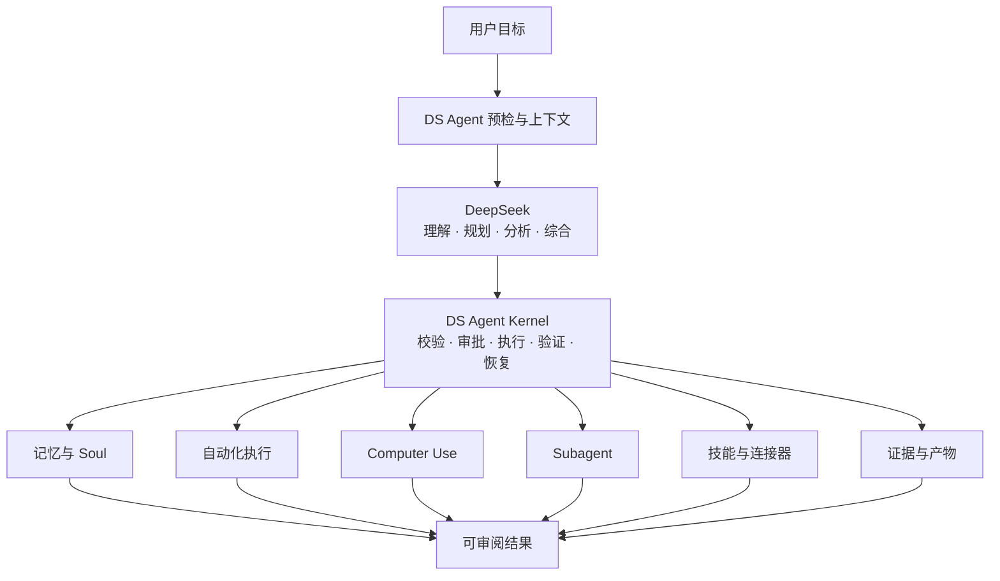

<p align="center">
  
</p>

<h1 align="center">DS Agent</h1>

<p align="center"><strong>一个 Kernel，模块化能力，统一可信执行。</strong></p>

<p align="center">
  <a href="README.md">English</a> · <a href="README.zh-CN.md">中文</a>
</p>

<p align="center">
  <a href="https://github.com/Lee-take/dsagent/releases/tag/v1.4.0">v1.4.0 正式稳定版</a> ·
  <a href="https://github.com/Lee-take/dsagent/releases/download/v1.4.0/DS.Agent_1.4.0_x64-setup.exe">下载 Windows 安装包</a> ·
  <a href="LICENSE">Apache-2.0</a>
</p>

<p align="center">由 <strong>Lee take</strong> 创建并维护。</p>

DS Agent 是一款面向日常工作的 DeepSeek-first 本地 Windows Agent。你只需在聊天中说明
想要的结果，它就能整理办公材料、开展带来源的研究、处理本地文件、运行持久自动任务，
并在你授权后操作桌面应用；整个过程保留可见步骤、证据、权限、验证和恢复机制。

在底层，DS Agent 是专门为 DeepSeek 优化的本地 Agent Harness。Harness 为模型驱动的
工作提供持久、受权限约束且可验证的本地执行边界。

DS Agent 源于一个很实际的需求：越来越多同事开始在日常工作中使用 DeepSeek，但很难
找到一个专门围绕 DeepSeek 大模型优化，同时具备强大本地自动化和可信执行边界的
Agent。

<p align="center">
  
</p>

<p align="center"><em>真实的本地 v1.0.0 运行：会议纪要被整理成可直接发送的执行清单，全部运行步骤可见并已完成。</em></p>

## 现在可以完成什么

- **把办公输入转成行动。** 将会议纪要、需求或零散材料整理为结构化清单、计划、报告和
  交接材料。
- **生成有证据的简报。** 阅读你选定的本地文件或公开网页来源，保留来源链接，形成可
  审阅的总结。
- **让重复工作持续运行。** 创建一次性、每天、每周或每月自动任务，并保存计划、有限
  重试和恢复状态。
- **在受控条件下操作电脑。** 只有经过明确权限、执行前后观察和结果验证，DS Agent 才会
  操作受支持的本地应用。

## 一个 Kernel，模块化能力

真正的差异点是：记忆、自动化执行、Computer Use、Subagent 并行协作和技能，并不是
彼此孤立的插件，而是由同一个 DS Agent Kernel 串成完整闭环。

DS Agent 采用契约优先的模块化 Harness 架构。新的工具、连接器、工作流、技能和执行器，
都通过统一契约接入权限、资源锁、幂等控制、证据、审计、验证与恢复能力。模块不能绕过
Kernel，也不需要各自重新构建一套状态机和安全体系。



## 五项核心能力，一套工程理念

### 记忆与 Soul

DS Agent 选择真正有用的长期记忆，而不是保存全部聊天记录。记忆回执会说明使用了什么
以及为什么使用；用户反馈会影响后续检索；可审计的后台维护能够自动更新、合并或归档
记忆。Soul 保存用户明确确认的身份、交流方式和协作偏好，让不同对话保持一致的合作
方式。

### 持久自动化

自然语言目标可以设置为一次性、每天、每周或每月任务。计划、触发窗口、运行状态、错过
任务策略和结果都会持久保存，应用重启后可以恢复。资源锁、有限重试和幂等校验用于避免
重复执行；自动任务不会获得比普通交互任务更宽的权限。

### 可验证的 Computer Use

电脑控制遵循完整安全闭环：
`执行前观察 → 审批 → 再次校验 → 只执行一次 → 执行后观察 → 验证结果`。
用户接管会停止控制，不确定的副作用不会自动重放；电脑控制还需要一次性审批和本地内存
解锁码。

### Subagent 并行协作

复杂任务可以拆分为数量受控的研究、分析、制作和审核角色。Subagent 使用隔离的上下文、
资源、预算和暂存区；审核绑定准确的制作版本；最终由父任务统一综合，不把内部过程刷满
主对话。

### 技能生成与自动使用

DS Agent 可以把合适的指令沉淀为声明式技能，完成校验和激活测试，并在更新时保持稳定
身份。任务需要时可以自动选择已安装技能。技能的来源、完整性、权限、信任状态、执行
计划、审计记录以及禁用/卸载能力仍然可见、可控。

## Loop Engineering

DS Agent 把工作当作目标驱动的闭环，而不是一次模型回复：

`目标 → 完成条件 → 上下文 → 规划 → 权限 → 执行 → 证据 → 验证 → 恢复`

Kernel 会持久保存任务和审核状态，只对失败步骤进行有边界的修复，并且不会仅凭模型信心
宣告完成。本地文件、浏览器操作、Office 产物和 Computer Use，只有在可观察证据满足任务
完成条件后才算真正完成。

在 v1.4.0 中，DeepSeek 可以提出有界 `GoalEnvelope`，但只有本地 Kernel 能校验并冻结它。
对于同一个排队任务，也只有 Kernel 能派生 capability manifest、风险和 preview，并显示为
一张 exact-task 授权卡。批准只产生精确权限，不会执行 Tool、恢复任务或把 Goal 标记为完成；
只有本地权威 verifier 证据覆盖冻结目标的全部 `done_when` 和必需产物身份后，任务才可能
进入完成状态。

v1.4.0 安装包新增了由 Kernel 授权的 T1 Excel 核对、PowerPoint/实际渲染验证，以及持久化的
Goal continuation checkpoint。这些是生产执行与验证原语，但普通聊天目前还不会自动选择和串联这两个 T1 工具。因此，本版本不宣称用户已经能从 React 聊天界面用一句话自动完成整条
T1 Office 工作流。

## DeepSeek 与 DS Agent 的工作边界

| 层 | 负责内容 |
| --- | --- |
| **DeepSeek** | 开放式理解、规划、分析、起草与综合。 |
| **DS Agent Kernel** | 确定性预检、上下文组装、策略、审批、执行、证据、审计、验证与恢复。 |

DeepSeek 可以提出动作，DS Agent 决定动作是否安全、是否允许执行。模型没有直接本地权限，
也不能自行批准高风险动作。详细说明见 [模型边界](docs/AGENT_MODEL_BOUNDARY.md)。

## 更多内置能力

- 本地文件和文件夹、带来源链接的网络研究、浏览器操作、终端诊断、屏幕查看以及权限化
  电脑输入。
- Markdown、HTML、轻量 PDF、Office 类产物、证据回执、报告和可移交工作包。
- Review、Recovery、持久 checkpoint、过期动作拒绝，以及对受支持本地文件变更的准确
  一次性 undo。
- 已通过离线对抗性 fake provider 验证的 Microsoft/Google 形态邮件、日历、同步、草稿、
  外部变更和对账契约。

v1.4.0 仍未开放生产 Microsoft/Google 账号注册和真实外部写入权限。当前正式版不会登录
真实账号、发送真实邮件，也不会创建、修改或取消真实日历事件。

## 为什么使用 Rust

DS Agent Kernel 和桌面命令层使用 Rust，让本地执行保持可预测、强类型、内存安全和低
开销。Rust 尤其适合并发、资源所有权、持久状态转换、凭据隔离和准确错误处理。Tauri
command 与 React UI 保持薄层，业务状态由 Kernel 和持久投影统一拥有。

## 快速开始

1. 下载 [Windows x64 安装包](https://github.com/Lee-take/dsagent/releases/download/v1.4.0/DS.Agent_1.4.0_x64-setup.exe)。
2. 在首次设置中输入你自己的有效 DeepSeek API Key，并显式验证余额和模型；Key 使用
   Windows DPAPI 保存在本机。
3. 选择一个本地工作目录，由 readiness doctor 检查受管目录和可写状态。
4. 在聊天中描述你希望完成的结果；只有任务确实需要时，DS Agent 才会请求额外权限或
   前置条件。

用户自行提供有效的 DeepSeek API Key 是必备前提。DS Agent 不内置共享 Key，也不会
绕过 DeepSeek 的访问条件；实际使用仍须遵守 DeepSeek 的服务条款和账号规则。

v1.4.0 应用程序和安装包的 Authenticode 状态均为 `NotSigned`。Windows 可能显示
`Unknown publisher`（未知发布者）或 Microsoft Defender SmartScreen 警告。请只通过
本仓库的 HTTPS 链接下载，运行前核对 GitHub Release 中的 SHA-256，并阅读
[安装指南](docs/INSTALLATION.md)。

## Code signing policy（代码签名政策）

DS Agent `v1.4.0` 是如实披露的未签名版本。SignPath Foundation 申请已经提交、仍在等待
审批，本版本不会被描述为已签名。若以后获批，只从后续新版本开始签名，不替换本版本不可
移动的 tag 或资产，也不改写 v1.1.0、v1.2.0 或 v1.3.0。获准加入该计划的 Release 将遵循：**Free code signing provided by
SignPath.io, certificate by SignPath Foundation.** 完整说明见
[代码签名政策](CODE_SIGNING_POLICY.md)和[隐私政策](PRIVACY.md)。

### 从源码运行

```powershell
npx pnpm@9.15.9 install
npx pnpm@9.15.9 test
npx pnpm@9.15.9 --filter @deepseek-agent-os/desktop tauri:dev
```

在 Windows 上构建正式版本时，请使用不含空格的 `CARGO_TARGET_DIR`，例如
`D:\build-target\ds-agent-v1-release`。

## 正式稳定版

- Release：[DS Agent v1.4.0](https://github.com/Lee-take/dsagent/releases/tag/v1.4.0)
- 安装包：`DS.Agent_1.4.0_x64-setup.exe`
- 完整性：运行安装包前，核对 GitHub Release 中发布的最终字节数和 SHA-256。
- 首次设置：单一用户 Key、Windows DPAPI 本机存储、显式 DeepSeek 余额/V4 模型验证、
  无密 readiness 和 workspace doctor。
- 兼容性：既有 workspace 设置继续可读；环境 Key 需要显式验证；不会重写历史会话或
  connector vault。
- 目标契约：有界模型提议、Kernel 校验/冻结、只读 UI 状态，以及覆盖全部完成条件和
  必需产物身份的 fail-closed 证据门。
- 任务授权：一张由 Kernel 派生并绑定 manifest/risk/preview 的 exact-task 卡片、一次用户
  决策、逐能力审计和精确撤销；批准不会执行或恢复任务。
- T1 验证引擎：准确来源身份和 provenance、禁止覆盖的 XLSX/PPTX、真实本地渲染证据、
  有界修订和持久 continuation checkpoint；普通聊天尚不会自动选择和串联整条 T1 路径。

## 文档

- [安装指南](docs/INSTALLATION.md)
- [DS Agent 与 DeepSeek 的工作边界](docs/AGENT_MODEL_BOUNDARY.md)
- [v1 架构计划](docs/architecture/DS_AGENT_V1_ARCHITECTURE_PLAN.md)
- [v1.4.0 发布说明](docs/RELEASE_NOTES_v1.4.0.md)
- [v1.3.0 发布说明](docs/RELEASE_NOTES_v1.3.0.md)
- [v1.2.0 发布说明](docs/RELEASE_NOTES_v1.2.0.md)
- [v1.1.0 发布说明](docs/RELEASE_NOTES_v1.1.0.md)
- [v1 完成审计](docs/DS_AGENT_V1_COMPLETION_AUDIT.md)
- [安全说明](SECURITY.md) · [隐私政策](PRIVACY.md) ·
  [代码签名政策](CODE_SIGNING_POLICY.md) · [参与贡献](CONTRIBUTING.md) ·
  [开源许可](LICENSE)

DS Agent 是独立开源项目，不是 DeepSeek 官方产品，也不主张任何 DeepSeek 所有权、授权
或官方背书。项目使用 DeepSeek 名称，仅用于说明模型兼容性和 DeepSeek-first 设计方向。

中文搜索别名：DS Agent、DSAgent、dsagent、DeepSeek Agent OS。
