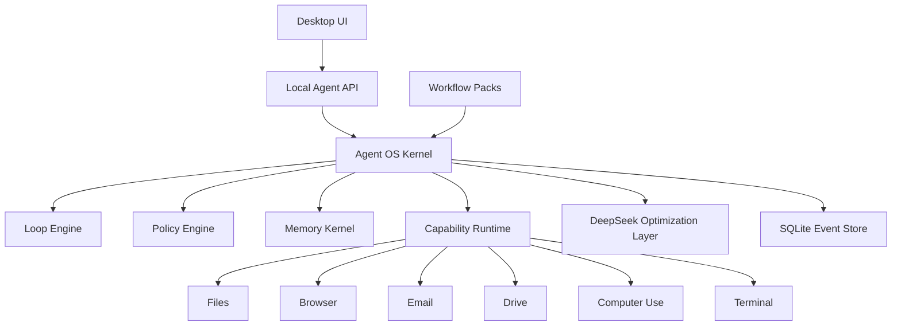
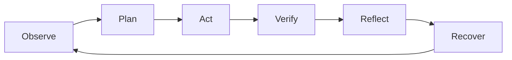
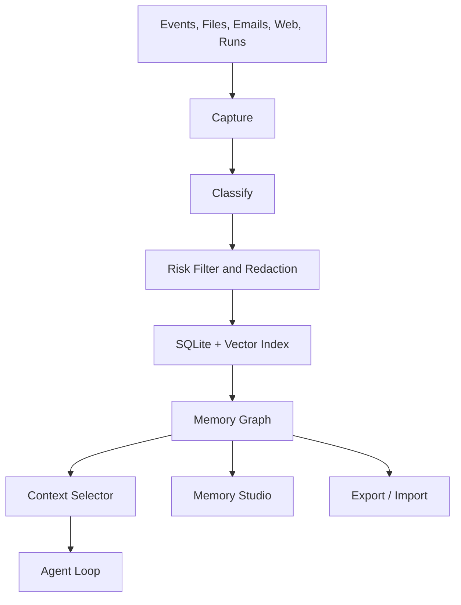

# DeepSeek Agent OS Architecture Design

Date: 2026-06-28

## 1. Purpose

Build an open-source desktop Agent OS optimized for DeepSeek. The product should serve ordinary office and operations users, while preserving a serious agent harness for coding, analysis, automation, document work, and future industry-specific workflows.

This is not a clone of Codex, Claude Code, OpenClaw, or CodeWhale. The goal is to combine the best lawful public ideas into one coherent desktop product:

- Codex: execution protocol, approvals, sandbox thinking, concise action path.
- Claude Code: user-facing product clarity, project memory conventions, developer ergonomics.
- OpenClaw: gateway, local token, multi-surface integrations, extensible capabilities.
- CodeWhale: DeepSeek provider work, task/fleet abstractions, workflow validation.
- learn-claude-code: minimal understandable agent loop.
- ECC: loop engineering, verification loops, autonomous harness patterns.

Leaked Claude Code source code must not be used.

## 2. Product Thesis

The product is a controlled execution system, not just a chat window.

The user should be able to give a real task, see the plan, grant only the required permissions, inspect evidence, receive usable artifacts, and preserve memory for future work.

The product should feel like a modern desktop workbench:

- clear enough for office and operations users;
- powerful enough for developers;
- auditable enough for sensitive business work;
- extensible enough for community packs;
- restrained enough to avoid becoming a feature pile.

## 3. Non-goals for MVP

- No cloud sync.
- No hosted team server.
- No arbitrary third-party executable plugins.
- No leaked-source-derived implementation.
- No attempt to support every connector deeply in the first milestone.
- No hidden memory writes without inspectability.

## 4. Architecture Overview

Use a stable Agent OS Kernel and scenario-specific Workflow Packs.

The accepted desktop stack is Tauri + React + TypeScript + Rust sidecar. React/TypeScript owns the workbench UI. Rust owns the local kernel, sidecar adapters, policy-sensitive operations, event persistence, and local token boundaries.

The kernel owns execution, policy, memory, event logging, and capability contracts. Workflow Packs provide scenario-specific inputs, templates, permissions, validation, and outputs.

## 5. Kernel Objects

The kernel should be scenario-neutral. These objects are stable:

- `Workspace`: a project or working area.
- `Actor`: local user, future teammate, imported package author, or agent identity.
- `Role`: owner, reviewer, operator, viewer, future team roles.
- `Task`: user-visible unit of work.
- `Run`: one execution of a task.
- `Step`: plan, read, analyze, act, verify, reflect, recover.
- `Artifact`: document, spreadsheet, email, PPT, code, screenshot, webpage, dataset, or report.
- `Capability`: a permissioned ability such as file read, browser browse, email draft, terminal run, or Computer Use.
- `Policy`: rules that decide what is allowed, denied, or requires approval.
- `Memory`: reusable knowledge with source, scope, and lifecycle.
- `Verification`: checks, evidence, validation results, and residual risk.
- `AuditLog`: immutable record of actions, approvals, model use, and imports/exports.

## 6. Workflow Packs

Workflow Packs are configuration-first, not code-first.

An MVP pack may contain:

- manifest metadata;
- user-facing task forms;
- prompt templates;
- capability declarations;
- permission defaults;
- input and output schemas;
- report/email/PPT templates;
- verification recipes;
- sample datasets or examples;
- memory scope rules.

Arbitrary executable code is excluded in MVP. Future code-based packs require sandboxing, signatures, permission declarations, version review, and stable plugin APIs.

First sample pack: Operations Management Pack.

First workflow: Operations Briefing.

The Operations Briefing workflow takes a local evidence folder and produces:

- an evidence-backed management brief;
- an anomaly table;
- an action plan with owner, metric, expected impact, and risk;
- an exportable report package;
- a Run Archive with sources, decisions, approvals, generated artifacts, and memory candidates.

This is the first end-to-end sample because it exercises the kernel without embedding operations-specific logic in the kernel.

The pack may support:

- operating analysis;
- report drafting;
- meeting material preparation;
- business anomaly explanation;
- action plan generation;
- evidence-backed management memos.

Operations logic must not be embedded in the kernel.

## 7. Loop Engineering

The agent loop should be typed and observable:

Step meanings:

- `Observe`: collect task, workspace state, relevant memory, files, messages, web evidence, and current permissions.
- `Plan`: create a typed plan or task DAG with budget and risk.
- `Act`: use capability adapters only through policy.
- `Verify`: run checks appropriate to the workflow.
- `Reflect`: propose memory updates and workflow improvements.
- `Recover`: summarize failure, retry with smaller scope, rollback, or request user guidance.

Every step emits events to the SQLite event store.

## 8. Latency Controller

The kernel needs a latency controller so simple tasks do not enter a heavy agent loop.

Execution modes:

- `Fast Path`: quick rewrite, summary, extraction, small drafting. Minimal context, no broad memory, no heavy tool planning.
- `Workflow Path`: normal office/operations task. Uses current pack, selected memory, relevant capabilities, and verification.
- `Deep Work Path`: complex multi-source or high-risk work. Uses task DAG, explicit progress, richer memory/context, and stronger verification.

Targets:

- text task: first usable result within 3 seconds where possible;
- standard workflow: plan visible within 5 seconds, first draft within about 30 seconds where possible;
- deep task: execution DAG visible within 10 seconds and streaming progress thereafter.

Metrics to store:

- first token latency;
- first action latency;
- model latency;
- tool latency;
- context size;
- cache hit/miss;
- total cost estimate;
- number of approvals;
- mode selected.

## 9. Policy Engine

Policy must be capability-specific and visible in the UI.

User-facing controls should be similar to Codex dropdowns, but clearer for office users:

- Every step asks.
- Ask on risk.
- Limited auto-execute.
- Full access.

Each access level must combine a permission mode and a scope. Scopes include:

- current file;
- current folder;
- current workspace;
- any local file;
- internet search;
- web browse;
- form submission;
- email read;
- email draft;
- email send;
- drive read;
- drive write/share;
- terminal read-only command;
- terminal write command;
- Computer Use screenshot;
- Computer Use mouse/keyboard control.

High-risk operations must always be auditable. Email send, destructive file edits, terminal writes, web form submission, account actions, and Computer Use control need clear approval defaults.

## 10. Memory Kernel

Memory is a first-class system.

It should not be a simple chat summary, a single markdown file, or an opaque vector database.

Memory pipeline:

Memory types:

- User Memory: preferences, tone, habits.
- Workspace Memory: project facts, data definitions, file locations, rules.
- Organization Memory: team rules, brand voice, compliance requirements.
- Task Memory: goal, process, conclusion, evidence.
- Artifact Memory: output artifact lineage and version.
- Failure Memory: errors, failed commands, recovery patterns.
- Workflow Memory: reusable task process that can become a pack template.

Required metadata:

- id;
- type;
- source event/run/artifact;
- scope;
- sensitivity;
- confidence;
- createdAt;
- updatedAt;
- expiresAt or lifecycle;
- actor;
- linked artifacts;
- conflict status;
- deletion/edit history.

Memory rules:

- automatic capture is enabled;
- users can inspect, edit, disable, delete, and export memory;
- sensitive memory is marked and can be excluded from export;
- memory is not a permission system;
- policy overrides memory;
- conflicting memories are surfaced instead of silently merged;
- long-term memory requires source traceability.

MVP includes Memory Studio as a primary page, not a buried setting.

## 11. DeepSeek Optimization Layer

DeepSeek support is not just an API adapter. The product should optimize for DeepSeek-native behavior.

Components:

- Model Router: DeepSeek Auto, Pro, Flash.
- Thinking Controller: fast, standard, deep, auto.
- Reasoning State Manager: preserve reasoning/tool-call state correctly.
- Cache-Aware Context Builder: stable prompt prefixes and predictable context order.
- 1M Context Policy: long context support without indiscriminate stuffing.
- Cost/Latency Scheduler: track cache hit/miss, model split, and throughput.
- Compatibility Layer: translate OpenAI/Anthropic-style messages into internal schema.
- Anonymous user_id strategy: local, non-PII, workspace-aware identifiers for cache and safety isolation.

DeepSeek-specific defaults:

- Flash for classification, extraction, summarization, small drafts, and low-risk actions.
- Pro for complex reasoning, multi-source verification, final important output, and high-risk planning.
- Auto for ordinary users, with visible override controls.

Relevant public references:

- DeepSeek-V4 paper: `https://arxiv.org/html/2606.19348v1`
- DeepSeek V4 release: `https://api-docs.deepseek.com/news/news260424`
- DeepSeek Thinking Mode: `https://api-docs.deepseek.com/guides/thinking_mode`
- DeepSeek Context Caching: `https://api-docs.deepseek.com/guides/kv_cache`
- DeepSeek pricing/models: `https://api-docs.deepseek.com/quick_start/pricing`
- DeepSeek R1 paper: `https://arxiv.org/abs/2501.12948`

## 12. Capability Runtime

Capabilities are adapters behind the policy engine.

MVP capability families:

- File: read, write draft, patch, export.
- Browser: search, open, scrape selected page, form fill with approval.
- Email: read, summarize, draft, send with approval.
- Drive: read, download, upload/export with approval.
- Computer Use: screenshot, inspect, click/type with high-risk controls.
- Terminal: mostly for developer pack and diagnostics; disabled or approval-heavy for office packs.

Every capability call returns structured results:

- success/failure;
- output;
- artifacts created;
- warnings;
- policy decision;
- elapsed time;
- evidence reference.

## 13. Import and Export

The product supports two package types.

`Workspace Package`:

- workflow pack manifest;
- templates;
- permission declarations;
- output schemas;
- verification recipes;
- optional sample data;
- optional scoped memories.

`Run Archive`:

- task goal;
- plan;
- steps;
- approvals;
- evidence;
- model/provider metadata;
- outputs;
- memory candidates;
- verification results;
- residual risks.

Import flow:

- never write directly into active workspace;
- show package source, author, timestamp, version, and requested capabilities;
- allow template-only import;
- allow workflow/template import in MVP;
- allow read-only Run Archive replay in MVP;
- turn imported memories into reviewable candidates instead of writing them automatically;
- allow memory exclusion;
- flag sensitive or external data;
- log import decision;
- support read-only preview.

## 14. Login, Local Token, and Security

The desktop app should support:

- local unlock password or OS-backed unlock;
- generated local agent token;
- token rotation;
- token revocation;
- recent token usage log;
- secure storage via OS mechanisms where possible;
- no plaintext token in ordinary config files.

The token is used by:

- local API;
- browser extension or browser bridge;
- Computer Use bridge;
- sidecar processes;
- future CLI.

## 15. UI Direction

The first screen should be the workbench, not a marketing page.

Primary areas:

- left rail: workspace, tasks, packs, memory, imports/exports;
- center: task conversation plus loop timeline;
- right inspector: evidence, context, memory, permissions, artifacts;
- bottom drawer: tool output, browser/computer-use trace, terminal/test output where relevant.

Composer controls:

- model/provider: DeepSeek Auto / Pro / Flash, later other providers;
- access: Every step / Ask on risk / Limited auto / Full access;
- thinking: Auto / Fast / Standard / Deep;
- scope: current file/folder/workspace/connected sources.

UI principles:

- modern, restrained, dense enough for work;
- beautiful but not decorative;
- strong visual status for permissions and risk;
- no TUI-like roughness;
- Memory Studio and Approval Center are first-class pages;
- ordinary users should not need to understand tokens, tools, or agent internals to finish work.

## 16. Persistence

Local persistence uses SQLite as the primary event and metadata store.

Stores:

- Event Store;
- Memory Store;
- Artifact Store;
- Capability Credential/Token references;
- Package Registry;
- Audit Log;
- Run Index.

Large artifacts can remain on disk with checksums and references in SQLite.

## 17. Testing and Verification Strategy

The project should be built in small verifiable slices.

Test categories:

- unit tests for policy decisions;
- unit tests for memory classification and conflict handling;
- integration tests for capability adapters;
- import/export roundtrip tests;
- DeepSeek message schema tests;
- latency controller tests;
- UI smoke tests for key workflows;
- security tests for token storage and permission boundaries.

Verification before shipping a slice:

- build;
- typecheck;
- lint;
- unit tests;
- integration tests for touched capability;
- manual or automated UI smoke path;
- permission/audit log inspection.

## 18. MVP Scope

Recommended MVP:

- Tauri desktop shell with React UI and Rust sidecar.
- Local Agent API and event store.
- DeepSeek provider with Auto/Pro/Flash routing.
- Basic task workbench.
- Permission dropdown and policy engine.
- Memory capture plus Memory Studio v1.
- File capability.
- Browser capability.
- Email draft/read capability, send approval path.
- Drive read/export capability.
- Computer Use behind explicit experimental high-risk flag, with screenshot/inspect first and per-step approval for click/type.
- Operations Management Pack v1 with Operations Briefing workflow.
- Workspace Package and Run Archive full export.
- Import preview, workflow/template import, read-only Run Archive replay, and review-only imported memory candidates.
- Local unlock and local agent token.

## 19. Deferred Scope

- Cloud sync.
- Hosted team service.
- Enterprise admin console.
- Arbitrary third-party code plugins.
- Full marketplace.
- Full multi-agent fleet UI.
- Native mobile apps.
- Deep enterprise integrations beyond adapter contracts.

## 20. Resolved MVP Defaults

The following defaults are accepted:

1. Desktop stack: Tauri + React + TypeScript + Rust sidecar.
2. First Operations Management workflow: Operations Briefing.
3. Import behavior: full export, import preview, workflow/template import, read-only Run Archive replay, and review-only memory candidates.
4. Computer Use: experimental high-risk flag, screenshot/inspect first, click/type only with per-step approval, no full-auto Computer Use in MVP.

## 21. Remaining Open Questions

1. Decide whether to initialize `D:\deepseek UI` as the git repository root before implementation planning.
2. Decide whether the first open-source release starts as a monorepo.
3. Decide the exact sample input files for the Operations Briefing workflow.

## 22. Review Checklist

- No leaked source dependency.
- Kernel is not tied to operations workflow.
- Memory is automatic but auditable.
- Permissions are granular and capability-specific.
- DeepSeek optimization is first-class.
- Import/export supports collaboration without cloud sync.
- Latency design avoids OpenClaw-style always-heavy execution.
- Extension model is safe by default.
- Team collaboration is modeled but not exposed as cloud functionality.
