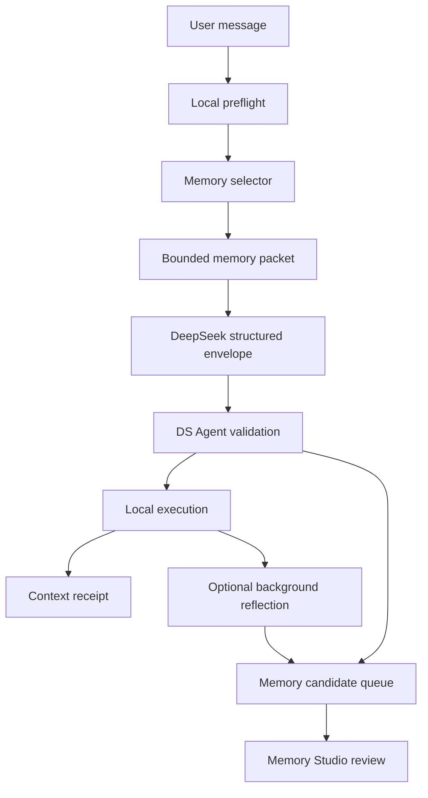

# DS Agent Memory Runtime v1 Design

Date: 2026-07-06

## 1. Purpose

Upgrade DS Agent memory from a passive Memory Studio surface into a bounded
runtime capability for loop engineering.

The goal is not to make every DS Agent task slower, more complicated, or more
memory-driven. Memory should help a one-sentence task start with the right
local context when that context is clearly useful. The hot path must stay
small, deterministic, inspectable, and easy to disable.

Memory Runtime v1 should let DS Agent:

- select a few relevant reviewed memories before calling DeepSeek;
- record why each memory was selected;
- inject only compact, safe memory snippets into the model packet;
- show a context receipt so users can see what influenced the run;
- accept memory suggestions only as reviewable candidates;
- avoid silent writes, privacy leaks, memory poisoning, and endless memory
  optimization loops.

## 2. Reference Patterns

These references shape the design, but DS Agent should not copy their full
systems into the first implementation.

- Claude Code memory separates user-written project instructions from automatic
  local memory. Its documented behavior treats memory as context rather than
  enforcement, scopes automatic memory locally, and exposes a `/memory` command
  for visibility and control:
  <https://docs.anthropic.com/en/docs/claude-code/memory>
- Codex `AGENTS.md` guidance shows a useful split between durable project rules
  and runtime memory. It favors small, practical repository instructions:
  <https://developers.openai.com/codex/guides/agents-md>
- mem0 is a broad memory layer for AI agents and assistants. DS Agent can learn
  from its SDK-style memory primitives and evaluation mindset, but should not
  add an external memory dependency in v1:
  <https://github.com/mem0ai/mem0>
- Graphiti emphasizes temporal knowledge graphs, provenance, and changing facts.
  DS Agent should borrow the ideas of lifecycle, provenance, and replacement
  without adding graph infrastructure in v1:
  <https://github.com/getzep/graphiti>
- LangMem separates memory primitives from storage and supports agent learning
  over time. DS Agent should borrow the hot-path versus background-management
  split:
  <https://github.com/langchain-ai/langmem>

## 3. Existing DS Agent Baseline

Current source already has the important foundation:

- `MemoryRecord` and `MemoryCandidate` support type, scope, sensitivity,
  lifecycle, expiration, source links, and review-safe defaults.
- `EventStore` persists memory as append-only kernel events and already filters
  deleted and expired memory from visible records.
- Memory Studio supports pending candidates, conflict surfacing, link, merge,
  replace, edit, delete, and expiration workflows.
- Agent chat responses already parse DeepSeek `memory_candidates` and store
  them as pending review items only.
- `AgentContextReceipt` already has a `selected_memories` field, but central
  chat currently records that memory selection is not wired into context
  receipts.

Memory Runtime v1 should reuse these pieces instead of adding a second memory
store.

## 4. Non-Goals

Memory Runtime v1 must not:

- add embeddings, a vector database, or a knowledge graph dependency;
- call a model just to select memory before every task;
- write long-term memory silently from a model response;
- load all memory records into the DeepSeek prompt;
- treat memory as permission, policy, or an override of user intent;
- optimize, summarize, or rebuild memory recursively during the user's active
  task;
- block local actions while background memory work is running;
- expose raw secrets, API keys, private local paths, or unrelated private
  evidence to the model.

## 5. Design Principles

### Memory Serves the Loop

Memory enters the loop only when it helps the current task. The core loop stays:

1. local deterministic preflight;
2. compact context packet;
3. DeepSeek reasoning when needed;
4. DS Agent validation and local execution;
5. evidence validation;
6. reviewable memory candidate proposal;
7. audit and receipt.

### Hot Path Is Cheap

The central chat hot path gets one local memory-selection pass. No model call,
background compaction, recursive search, or multi-stage memory refinement runs
before the first DeepSeek request.

### Review Beats Automation

Memory candidates are useful because they are reviewable. DS Agent should make
accept, edit, link, merge, replace, and reject easy. It should not make
unreviewed memory writes invisible.

### Memory Is Context, Not Authority

Memory can influence the model packet, but it cannot grant permissions, bypass
path checks, approve actions, or override the user's newest instruction.

### Receipts Build Trust

Every selected memory should leave a short receipt: what was selected, why it
was selected, what was sent, what was omitted, and what budget was applied.

## 6. Runtime Architecture



The memory selector is deterministic Rust code in the desktop kernel or command
layer. It reads visible long-term memory from `EventStore`, applies filters,
ranks candidates, creates compact snippets, and returns a packet plus receipt
metadata.

The selector does not mutate memory.

## 7. Data Shapes

### Selected Memory Context

Rust model, JSON-serializable:

```rust
pub struct AgentSelectedMemory {
    pub memory_id: Uuid,
    pub title: String,
    pub memory_type: MemoryType,
    pub scope: MemoryScope,
    pub sensitivity: MemorySensitivity,
    pub match_reason: String,
    pub inclusion_mode: MemoryInclusionMode,
    pub snippet: String,
    pub snippet_bytes: usize,
    pub omitted_fields: Vec<String>,
}

pub enum MemoryInclusionMode {
    Snippet,
    TitleOnly,
    OmittedSensitive,
    OmittedBudget,
}
```

### Memory Selection Receipt

```rust
pub struct AgentMemorySelectionReceipt {
    pub query: String,
    pub selected: Vec<AgentSelectedMemory>,
    pub omitted: Vec<String>,
    pub max_memories: usize,
    pub max_context_bytes: usize,
    pub created_at: DateTime<Utc>,
}
```

This receipt is projected into `AgentContextReceipt.selected_memories` as compact
human-readable lines for v1. A richer typed receipt can become its own event in
v2 if the UI needs drill-down.

## 8. Selection Rules

Default limits:

- max selected memories: `3`;
- max memory context packet: `1200` bytes;
- max snippet per memory: `280` characters;
- max pending candidates accepted from one model response: `3`;
- max candidate body length from model response: `1200` characters.

Filters:

- include only visible records from `EventStore::list_memory_records`;
- exclude expired and deleted memories through existing store projection;
- exclude `MemoryLifecycle::Archived` from hot-path injection;
- exclude `MemorySensitivity::Sensitive` by default, recording an omission;
- prefer `Project`, `Workspace`, then `User`, then `Organization` scope for a
  local DS Agent task unless the task explicitly names a broader context;
- never include source-machine-only path handles unless the current task and
  capability need them.

Ranking:

- direct title match;
- direct body match;
- linked memory title match;
- linked memory body match;
- pinned memory bonus;
- recent update as tie-breaker.

Ranking should stay explainable. Every selected item must produce a short
`match_reason`, such as `title match: office` or `linked memory body match:
release`.

## 9. Prompt Packet

`build_agent_chat_protocol_user_prompt` should include a compact section only
when memories are selected:

```text
Selected reviewed DS Agent memories for this run:
- [project_context/workspace] DS Agent boundary
  reason: title match: boundary
  snippet: DS Agent owns deterministic execution, permissions, audit, artifacts...
Memory selection limits: 1 selected, 392 bytes used, sensitive memories omitted.
```

If no memory is selected, the prompt should not carry a large empty section.

If memory was omitted, the prompt can include a compact line such as:

```text
Memory omissions: 2 sensitive memories omitted; 1 match omitted by budget.
```

This tells DeepSeek why context may be incomplete without leaking the omitted
content.

## 10. Candidate Generation

DeepSeek may return memory candidates in the existing structured envelope. DS
Agent must validate them before adding pending events:

- drop blank title or body;
- trim title, body, and rationale;
- cap candidate count per response;
- cap body length and add an omission note if truncated;
- normalize type, scope, sensitivity, lifecycle, and expiration;
- default unknown values to review-safe metadata;
- detect conflicts through existing Memory Studio logic;
- store as `MemoryCandidateSource::WorkflowReflection`;
- never create `MemoryRecord` until the user accepts, edits, links, merges, or
  replaces through Memory Studio.

Candidate generation should run after the user-visible task result. If
candidate validation is slow or fails, the task result should still complete.

## 11. Background Memory Work

Background memory work is optional and never part of the critical path.

Allowed background jobs:

- propose a memory candidate from a completed run;
- suggest that an old memory should be archived or replaced;
- generate a short conflict hint for Memory Studio.

Disallowed background jobs:

- automatic long-term writes;
- recursive memory summarization during an active task;
- broad re-indexing on every chat message;
- model-driven memory optimization loops without a user-visible stop condition.

Background jobs should have:

- fixed concurrency of one;
- small time budget;
- skip behavior when the app is busy;
- explicit audit entries for candidate creation;
- no retries beyond one immediate retry for transient local errors.

## 12. UI and User Controls

Memory Runtime v1 should reuse the existing chat-first workbench.

Central chat:

- assistant messages continue to show pending memory candidates;
- no new modal is needed for v1.

Right run/status rail:

- show a memory step with the first selected memory or `No memory selected`;
- show recent context receipts with selected memory lines;
- show omission lines when sensitive or over-budget memory was not included.

Memory Studio:

- keep candidate review as the main long-term write surface;
- add filters later for `Used recently`, `Sensitive`, and `Candidate source`.

Future `/memory`-style command:

- list memory files/records influencing the current run;
- toggle memory retrieval for the session;
- open Memory Studio;
- disable auto candidate generation for the session.

This command is useful, but not required for the first implementation slice.

## 13. Privacy and Safety

Memory Runtime v1 must defend against:

- secret leakage into model context;
- private local path leakage;
- memory poisoning from model output or imported packages;
- stale memory overriding newer user instruction;
- sensitive memories entering ordinary chat packets;
- candidate spam that overwhelms review.

Rules:

- user prompt and explicit current task override memory;
- policy and capability checks override memory;
- sensitive memory requires explicit inclusion logic;
- candidate writes are review-only;
- imported candidates remain pending review;
- receipts record omissions without revealing omitted content.

## 14. Performance Budget

Memory should not make DS Agent feel slower.

Targets for v1 on a normal local store:

- memory selection p95 under 50 ms for 500 records;
- prompt packet under 1200 bytes by default;
- no additional model call before the first DeepSeek request;
- no UI-blocking background memory job;
- no more than one candidate validation pass per model response.

If the store grows beyond the simple contains search envelope, the next upgrade
should be SQLite FTS or BM25-style ranking before embeddings or graph retrieval.

## 15. Implementation Slices

### Slice 1: Central Chat Memory Context v1

- Add selector data types and constants.
- Select up to three non-sensitive active memories before DeepSeek chat.
- Add compact selected memory packet to the protocol prompt.
- Fill `AgentContextReceipt.selected_memories`.
- Replace the current central-chat omission saying memory is not wired.
- Add focused Rust tests for selection, omission, prompt packet, receipt, and
  candidate review-only behavior.

### Slice 2: Candidate Validation Hardening

- Cap candidate count and body size.
- Record truncation or dropped-candidate reasons.
- Add tests that model-suggested memory cannot bypass review or flood the queue.

### Slice 3: UI Receipt Polish

- Surface selected memories and omissions in the right rail.
- Add compact copy for no-memory, selected-memory, and omitted-sensitive states.
- Keep the central chat uncluttered.

### Slice 4: Background Reflection Queue

- Add an optional background job that proposes candidates after completed runs.
- Keep it disabled or conservative by default until v1 telemetry proves the hot
  path is stable.

### Slice 5: Retrieval Upgrade

- Add SQLite FTS/BM25 only if tests show simple contains search is too weak.
- Revisit embeddings or temporal graph memory only after real local data volume
  requires it.

## 16. Test Plan

Focused Rust tests:

- selected memory appears in the DeepSeek prompt packet;
- sensitive memory is omitted and only an omission reason is included;
- archived and expired memories are excluded;
- linked memory matches produce explainable reasons;
- selection respects top-k and byte limits;
- context receipts record selected memory lines;
- model `memory_candidates` remain pending review and do not create records;
- model candidate flood is capped.

Regression tests:

- existing Memory Studio candidate accept/link/merge/replace tests continue to
  pass;
- existing agent chat action validation still blocks unsupported or risky
  actions;
- `cargo fmt --manifest-path apps/desktop/src-tauri/Cargo.toml --check`;
- `git diff --check`.

Frontend checks after UI slice:

- `npx pnpm@9.15.9 test`;
- manual smoke in the Tauri desktop app only when implementation reaches UI.

## 17. Acceptance Criteria

Memory Runtime v1 is successful when:

- a simple chat task can use relevant reviewed memory without any extra user
  setup;
- the model packet contains only compact selected memory snippets;
- the user can inspect which memories influenced the task;
- sensitive and over-budget memories are omitted visibly but safely;
- DeepSeek memory suggestions remain pending review;
- memory selection does not add a second model call or noticeably slow ordinary
  chat;
- all changes stay within the DS Agent versus DeepSeek boundary defined in
  `docs/AGENT_MODEL_BOUNDARY.md`.

## 18. Open Questions

- Should v1 expose a user-visible session toggle for memory retrieval, or should
  that wait for the later `/memory`-style control?
- Should selected memory receipts remain embedded in `AgentContextReceipt`, or
  should v2 introduce a dedicated `memory_selection.receipt_recorded` event?
- What threshold should promote SQLite FTS/BM25 from backlog to required work:
  memory count, latency, or measured selection accuracy?
